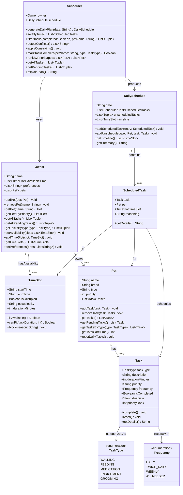

# PawPal+ Project Reflection

## 1. System Design
- Track pet care tasks (walks, feeding, meds, enrichment, grooming, etc.)
    Create Pet
        Hold a name for the pet and what breed the pet is/ what it is
    Today's schedule/Task
    List of all the time what is occupied in the time and what task it is

    Make them do pet care tasks/schedule -- creates the task/ scheduling the task below
        walking
        Feeding
        meds
        enrichment
        gromming
- Consider constraints (time available, priority, owner preferences)
    Time avaliable of Owner
    Priority of pet to take care of first
    Owner preference of how they want their pet to be taken care of
- Produce a daily plan and explain why it chose that plan

**a. Initial design**

The initial design used seven classes organized around an Owner who owns Pets, each Pet holding a list of Tasks, and a Scheduler that produces a DailySchedule.

**Updated UML — reflects final implementation in `pawpal_system.py`:**

| Class | Responsibility |
|---|---|
| `TaskType` | Enum listing the five care categories (walking, feeding, medication, enrichment, grooming) so task types are never raw strings |
| `TimeSlot` | Represents one block of the owner's day; tracks whether it is occupied and by what |
| `Task` | A single care action for a pet — stores the type, how long it takes, and its priority |
| `Pet` | Holds a pet's identity (name, breed, species) and its numeric priority relative to other pets; owns a list of Tasks |
| `Owner` | Central user object — stores the owner's name, their free TimeSlots, their care preferences, and the pets they own |
| `ScheduledTask` | A resolved assignment linking one Task to one Pet and one TimeSlot; also stores a `reasoning` string so the plan can explain itself |
| `DailySchedule` | The output artifact — an ordered list of ScheduledTasks for a given date, plus a summary printer |
| `Scheduler` | Orchestrator — reads the Owner's constraints, ranks pets by priority, fits tasks into available TimeSlots, and returns a DailySchedule |

**b. Design changes**

Yes, three changes were made after an AI code review of the skeleton.

1. **Added `duration_minutes` property and `can_fit()` to `TimeSlot`.**
   The original `TimeSlot` stored `start_time` and `end_time` as plain strings but had no way to compute how long the window actually was. Without this, the Scheduler could never check whether a `Task.duration_minutes` would fit inside a slot before assigning it — a logic bottleneck that would have caused incorrect scheduling. The fix parses the two time strings with `datetime.strptime` and exposes both the computed duration and a `can_fit(task_duration)` helper.

2. **Added `unscheduled_tasks` list to `DailySchedule`.**
   If the owner's day is too full to fit every pet task, the original design had nowhere to put the overflow. Tasks would silently be skipped with no record. Adding `unscheduled_tasks: list[Task]` makes gaps in the plan visible and lets the summary explain what was left out.

3. **Added a `date` parameter to `generate_daily_plan()`.**
   The original `Scheduler.schedule` defaulted to `DailySchedule(date="")`, meaning the date was never properly set unless the caller remembered to set it manually. The fix makes `date` an explicit parameter of `generate_daily_plan()`, which now creates a fresh `DailySchedule` with the correct date and seeds its timeline directly from `owner.available_time`.

---

## 2. Scheduling Logic and Tradeoffs

**a. Constraints and priorities**

The scheduler considers three constraints in this order:

1. **Pet priority** — pets with a lower `priority` number are served first. A dog that needs medication is more critical than a cat that needs enrichment, and that should be reflected in who gets the first available slot.
2. **Task priority** — within each pet, tasks ranked `high` (medication, feeding) are placed before `medium` (walking) and `low` (grooming).
3. **Owner's available time** — tasks are only placed in `TimeSlot`s that are free and wide enough (`can_fit()`). Slots that are too short are skipped; tasks that find no slot land in `unscheduled_tasks`.

Pet priority was chosen as the outermost constraint because a pet's overall welfare matters more than any individual task ordering. Within a pet, task priority matters because missing medication is worse than skipping a grooming session.

**b. Tradeoffs**

The scheduler uses a **first-fit strategy**: it assigns each task to the first available slot that is long enough, without looking ahead to see if a later slot would allow more tasks to fit overall. This means a 30-minute walk can consume a large morning slot, leaving no room for a 5-minute medication that could have been placed there instead.

This tradeoff is reasonable for a daily pet-care scenario because correctness and simplicity matter more than slot utilisation. A pet owner doesn't need an optimal bin-packing solution — they need a clear, predictable plan that always schedules the highest-priority tasks first and transparently lists anything it couldn't fit. A look-ahead or backtracking algorithm would be harder to explain and debug without meaningfully improving real-world outcomes.

---

## 3. AI Collaboration

**a. How you used AI**

I used VS Code Copilot across three phases of the project, each with a different mode:

- **Inline completions (Tab)** were most useful when implementing the `Scheduler` methods. Once I typed the method signature and a docstring, Copilot would autocomplete the loop skeleton — for example, the `for i, a in enumerate(entries): for b in entries[i+1:]` pattern in `detect_conflicts()`. This saved time on boilerplate and let me focus on verifying the logic rather than typing it.

- **Copilot Chat / `#codebase` context** was the most effective feature overall. By asking questions like *"What methods does Scheduler need to support sort, filter, and conflict detection?"* with `#codebase` attached, Copilot could see the existing class definitions and give answers that were consistent with the actual data model instead of generic suggestions. This was especially helpful when drafting the test file — I described the expected behavior in plain English and Copilot generated pytest fixtures that matched the real class signatures.

- **Explain and refactor prompts** helped during debugging. When `detect_conflicts()` was returning false positives for adjacent (back-to-back) slots, I pasted the method into Copilot Chat and asked it to explain the overlap condition step by step. It caught that `<=` should be `<` in the boundary check, which I confirmed against the standard interval-overlap theorem before accepting the change.

The most useful prompt pattern was: *"Given this class definition [paste], write a method that [behavior] and handles [edge case]."* Concrete, constrained prompts produced usable code far more often than open-ended ones.

**b. Judgment and verification**

When I asked Copilot to scaffold `generate_daily_plan()`, it initially suggested sorting the combined task list by priority before the scheduling loop, producing a flat list of `(pet, task)` tuples ordered only by task priority. I rejected this because it ignored pet priority entirely — a low-priority pet's high-priority task would jump ahead of a high-priority pet's medium task, which violates the design intent.

I modified the suggestion to use a **two-level sort**: first process pets in pet-priority order (`get_pets_by_priority()`), then within each pet process tasks in task-priority order (`get_pending_tasks()`). I verified this was correct by writing test 12 ("Priority ordering") and checking that the high-priority pet's task appeared before the lower-priority pet's task in the resulting schedule.

**c. Separate chat sessions per phase**

Using a fresh Copilot Chat session for each phase (UML design, class skeleton, scheduling logic, tests, UI) kept the context window clean and focused. When the session only contained code from the current phase, Copilot's suggestions were more precise — it didn't confuse a naming convention from the UML phase with what was actually implemented in the Python file. It also made it easier to review the conversation later: each session was a self-contained record of the decisions made at that stage.

**d. Being the "lead architect"**

Working with Copilot taught me that AI is a very fast, very literal collaborator — it will complete whatever pattern you start, but it has no stake in whether the overall design is coherent. Every method it generated was locally reasonable, but stitching them together into a system that behaved correctly (correct priority ordering, no silent task drops, proper recurrence) required constant architectural judgment on my part.

The key skill was knowing *what to ask for* and *what to verify*. I had to hold the design constraints in my head — "pet priority is the outer loop, task priority is the inner loop, slots must not be double-booked" — and check every suggestion against those constraints before accepting it. AI accelerated the writing; I was still responsible for the thinking.

---

## 4. Testing and Verification

**a. What you tested**

The 15 tests cover four behavioral categories:

1. **State mutations** — `complete()` flips `is_completed`; `add_task()` grows the task list by exactly one. These are the lowest-level guarantees the rest of the system depends on, so testing them first gives a stable foundation.

2. **Scheduling algorithm** — tests for priority ordering (high-priority task placed first), no-slots-available (all tasks land in `unscheduled_tasks`), and task-too-long (overflow also goes to `unscheduled_tasks`). These cover the two outcomes of `_find_slot()` — success and failure — and confirm that the priority-ordering loop processes pets and tasks in the right sequence.

3. **Algorithmic features** — sort by time (chronological order, empty schedule), conflict detection (true overlap vs. adjacent boundary), and task filtering (by status, by pet name). These test the four "smarter scheduling" methods independently so a bug in one cannot hide behind another.

4. **Recurrence logic** — daily (+1 day), weekly (+7 days), and AS_NEEDED (no spawn). These are the trickiest behaviors because they create new objects as a side effect of marking a task done; testing all three frequency variants prevents regressions if the `_RECUR_DAYS` lookup table is ever changed.

These tests matter because they cover the code paths most likely to break silently — a task that is "scheduled" but in the wrong order, or a recurring task that doesn't spawn, produces no crash, just wrong output.

**b. Confidence**

★★★★☆ (4/5) — All 15 tests pass and the most critical edge cases are covered. My confidence is high for the core scheduling loop and the four algorithmic features.

The remaining gap is at two levels:
- **Integration**: the Streamlit UI is not tested — a bug in the session-state wiring or the dataframe rendering would not be caught by the current suite.
- **Multi-day recurrence chains**: the tests confirm that one recurrence is spawned correctly, but they don't verify that repeatedly marking a task done produces a correct chain of due dates over several days.

If I had more time I would add: (1) a test that marks the same task done three times and asserts the due dates are day 0, day 1, and day 2; (2) a test that verifies `twice_daily` spawns on the same day rather than the next; and (3) a test for `apply_constraints()` to confirm pre-occupied owner slots are correctly blocked before scheduling begins.

---

## 5. Reflection

**a. What went well**

I'm most satisfied with how the conflict detection and recurrence features turned out. Both algorithms are short (under 20 lines each), clearly named, and backed by dedicated tests — which means I can explain exactly what they do and demonstrate that they work. The decision to return warning strings from `detect_conflicts()` rather than raising exceptions also paid off in the UI: the Streamlit app can show multiple conflict banners without crashing, which makes the app feel polished rather than brittle.

**b. What you would improve**

If I had another iteration, I would redesign the slot assignment strategy. The current first-fit approach can waste a large morning slot on a short task, leaving no room for a longer task that arrives later in the priority queue. I would replace it with a **best-fit** strategy: scan all free slots and pick the one whose duration most closely matches the task's duration. This would increase slot utilization without changing the priority-ordering logic, and the existing tests would still serve as a regression suite.

I would also add a proper `TimeSlot` overlap check *before* the owner can add conflicting free-time blocks in the UI, rather than only detecting conflicts after the schedule is generated.

**c. Key takeaway**

The most important thing I learned is that **design decisions compound**. Adding `unscheduled_tasks` to `DailySchedule`, making `date` an explicit parameter of `generate_daily_plan()`, and giving `TimeSlot` a `can_fit()` method each seemed like small additions, but together they are what made the scheduler correct, testable, and explainable. Had any one of them been missing, a different part of the system would have needed a messy workaround.

The same principle applies to working with AI: the quality of the output compounds with the quality of the design you bring to the collaboration. When I had a clear class diagram and concrete constraints in mind, Copilot's suggestions were easy to evaluate and quick to accept or reject. When I started a prompt without a clear design goal, I got plausible-but-wrong code that took longer to debug than writing from scratch would have. The lead architect's job is to maintain that clarity — AI amplifies whatever direction you give it, good or bad.
